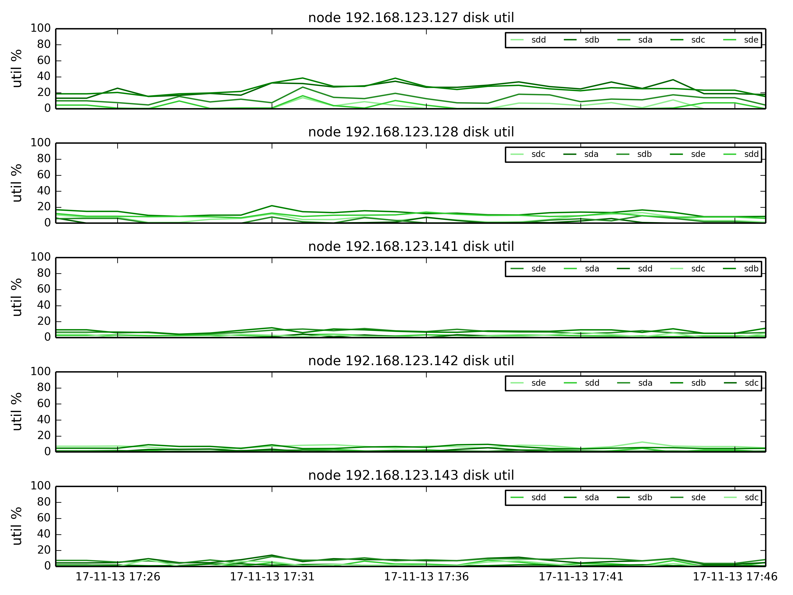

#                    **bigtera存储巡检报告**
# 巡检结果
集群状态正常，运行稳定,过去一段时间的运行情况详见如下：包括集群的带宽和iops，各个节点的网络使用情况、磁盘使用情况等
## 集群在过去30天内的带宽和iops情况如下

## 集群每个节点的存储业务网和存储内网的网络使用率

## 集群每个节点的磁盘使用率

# 本次巡检的检查项如下表，每个检查项的详细结果附在表后
检查项目列表如下
|检查项|检查函数|
| ------ | ----- |
|检查项|SSD Duration|
|检查项|Cluster Cacacity|
|检查项|EXT4-fs error|
|检查项|OS Partition Usage|
|检查项|MDS Status|
|检查项|OS Partition RO|
|检查项|Ceph Health|
|检查项|Process Number|
|检查项|Free Memory|
|检查项|Load Average|
|检查项|CTDB Status|
|检查项|OSD slow request|
|检查项|Broken Disk|
|检查项|Mon leader changed|
|检查项|High-Mem Process|
|检查项|RAID configure|
|检查项|OSD down|
|检查项|OSD failed|
## 集群检查情况
|检查项|检查结果|
| ------ | ----- |
|ceph health|HEALTH_WARN noout flag(s) set|
|集群容量使用|0.1952323048343473|
|osd down|No osd down in past 30 days|
|osd failed|No osd failed in past 30 days|
|mon 选举|No Mon leader changed happened in past 30 days|
## mds 运行状态
|节点IP|mds 状态|
| ------ | ----- |
|10.10.10.10|up|
|10.10.10.11|up|
|10.10.10.13|Not Enabled yet, Just Fine|
## ctdb 运行状态
|节点IP|ctdb 状态|
| ------ | ----- |
|10.10.10.10|OK|
|10.10.10.11|OK|
|10.10.10.13|Not Enabled|
## 各个节点内存消耗最多的进程
|节点IP|进程名以及占用内存|
| ------ | ----- |
|10.10.10.10|[{'cmd': '/usr/bin/ceph-mds', 'vsz': 2625, 'rss': 1992}]|
|10.10.10.11|[{'cmd': '/usr/bin/ceph-mon', 'vsz': 7570, 'rss': 5322}]|
|10.10.10.13|[{'cmd': '/usr/bin/ceph-mon', 'vsz': 7751, 'rss': 5224}]|
## 各个节点cpu的负载情况
|节点IP|1分钟cpu负载|5分钟cpu负载|15分钟cpu负载|
| ------ | ----- | ----- | ----- |
|10.10.10.10|2.08|2.23|2.23|
|10.10.10.11|1.75|2.18|2.18|
|10.10.10.13|0.54|0.64|0.64|
## 各个节点的进程数目
|节点IP|进程数目|
| ------ | ----- |
|10.10.10.10|911|
|10.10.10.11|903|
|10.10.10.13|268|
## 各个节点内存使用情况
|节点IP|总内存|可用内存|
| ------ | ----- | ----- |
|10.10.10.10|64400 MB|50267 MB|
|10.10.10.11|64400 MB|41617 MB|
|10.10.10.13|7984 MB|2073 MB|
## 各个节点系统盘的使用率
|节点IP|系统盘使用率(%)|
| ------ | ----- |
|10.10.10.10|27.8|
|10.10.10.11|29.4|
|10.10.10.13|14.6|
## 各个节点的进程数目
|节点IP|寿命需要注意的SSD|寿命正常的SSD|
| ------ | ----- |----- |
|10.10.10.10|[]|[{'wearout': 95, 'device': '/dev/sdd'}, {'wearout': 95, 'device': '/dev/sde'}]|
|10.10.10.11|[]|[{'wearout': 95, 'device': '/dev/sdf'}, {'wearout': 95, 'device': '/dev/sdg'}]|
|10.10.10.13|[]|[]|
## 各个节点的EXT4状态
|节点IP|EXT4状态|
| ------ | ----- |
|10.10.10.10|无EXT4错误|
|10.10.10.11|无EXT4错误|
