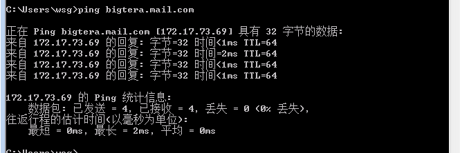
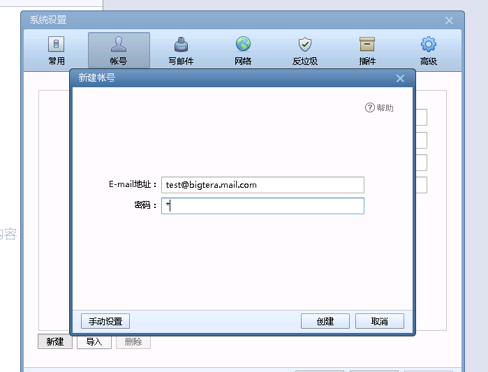
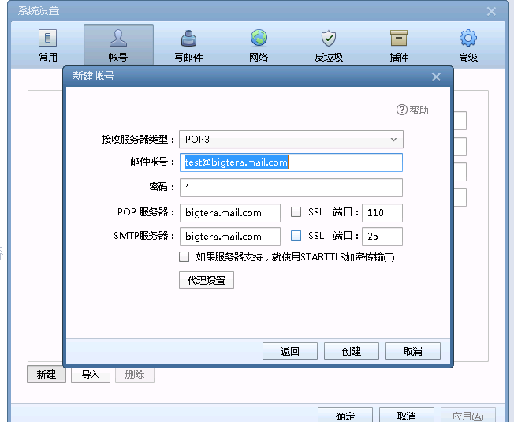
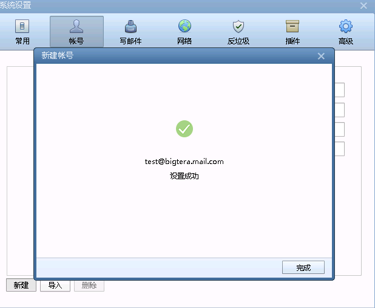
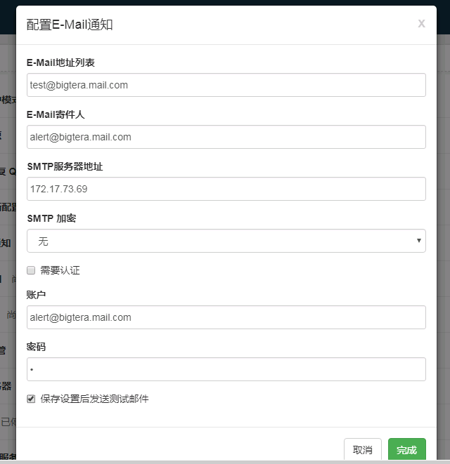
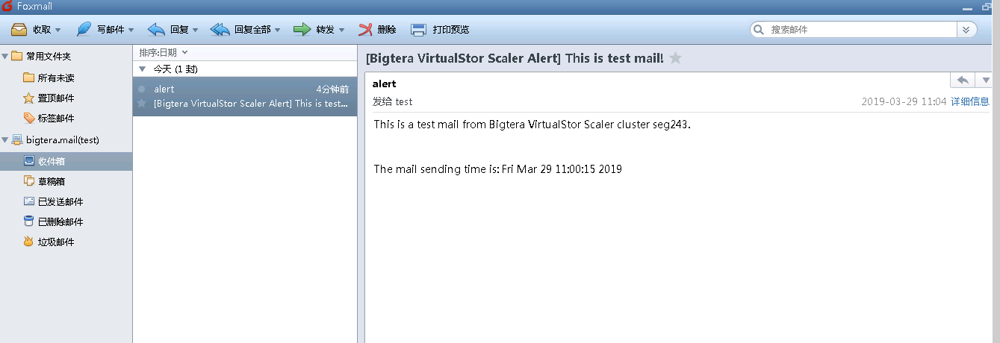

[TOC]

# mail docker 镜像使用说明

获取到镜像后，需要通过docker 先加载该镜像，命令如下

```
docker load -i 镜像文件名
```

如果加载成功可以看到镜像信息，如下

```
manu-Inspiron-5748 /var/log » sudo docker images
REPOSITORY          TAG                 IMAGE ID            CREATED             SIZE
bigtera/mail        latest              93252f0df226        17 hours ago        373MB

```

## 1. 环境变量说明

环境变量是在启动容器时，传递给容器，做初始化之用，主要有下面的环境变量

DOMAIN：邮件服务器的域名

USER/PASSWORD：默认的告警邮箱收件人和登陆密码


## 2. 启动容器

> 注意环境变量的传入

```
docker run -d  --name bigtera-mail -p 25:25  -p 110:110 --env="DOMAIN=bigtera.mail.com" --env="USER=test" --env="PASSWORD=1" bigtera/mail

```

> 需要占用host主机端口号，25 for smtp，110 for pop3
>
> 


## 3. 告警邮件测试
### 3.1 配置foxmail 客户端

1，增加域名解析

因为是通过域名方式来登陆邮件服务器，需要确保客户端可以正常访问该域名，windows可以通过手动设置host 文件来实现，win10路径位于`C:\Windows\System32\drivers\etc\hosts`

该配置文件中增加邮箱域名到host主机ip的映射，如下

```
172.17.73.69	bigtera.mail.com
```

> 其中73.69是host主机的ip，需要根据实际情况修改

修改完，客户端 ping 邮箱域名，确保可以正常解析，如下图




2，配置foxmail用户

容器启动后，会默认创建2个邮箱用户，分别为alert和test（密码是1），alert用户是给web管理配置用（后面配置有说明），test是给foxmail客户端。如果需要更多用户来接受告警邮件，可以进入容器手动创建用户，后面会有说明。

* 增加test用户

  

  

> 注意，选择pop3协议，邮箱不支持ssl加密，参照上面配置（上面配置一般是自动生成，不需要手动修改）



至此，foxmail客户端配置完成


###3.2 存储 web界面测试发送告警邮件

如前面所说，container的初始化脚本中，会创建一个alert用户，该用户用来告警的寄件人，配置如下：



> 说明：E-Mail地址列表是告警邮件的收件人，这里用默认的test用户（可以手动增加其他用户）
>
> E-Mail 寄件人，一般用用户alert（该用户是容器启动时，自动创建的）
>
> 

配置完，选择完成，会发送测试邮件，然后确认foxmail客户端是否正常收到告警邮件（下图显示已经收到了测试邮件）

 


## 4. 增加邮箱用户

除了了容器启动时，创建的2个默认邮箱用户，如果需要增加其他用户，需要手动增加，步骤如下：

1. 登陆host主机，然后进入容器

   ```
   root@wsg:~# docker exec  -it bigtera-mail /bin/bash
   [root@041f5032824f /]# 

   ```

2. 在容器中增加用户

   ```
   [root@041f5032824f /]# useradd test2
   [root@041f5032824f /]# passwd test2
   Changing password for user test2.
   New password: 
   BAD PASSWORD: The password is a palindrome
   Retype new password: 
   passwd: all authentication tokens updated successfully.
   [root@041f5032824f /]# 

   ```

3. 为用户创建收件目录(注意，要先切换到test2用户)

   ```
   [root@041f5032824f /]# su - test2
   [test2@041f5032824f ~]$ mkdir -p ~/mail/.imap/INBOX
   [test2@041f5032824f ~]$ ll /home/test2/
   total 4
   drwxrwxr-x 3 test2 test2 4096 Mar 29 03:12 mail
   [test2@041f5032824f ~]$ 

   ```

   ​

